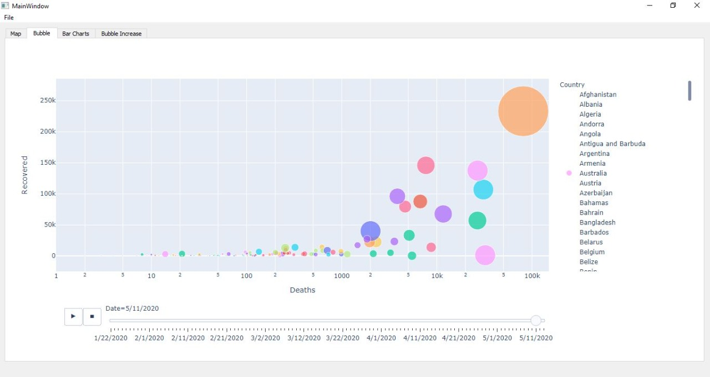
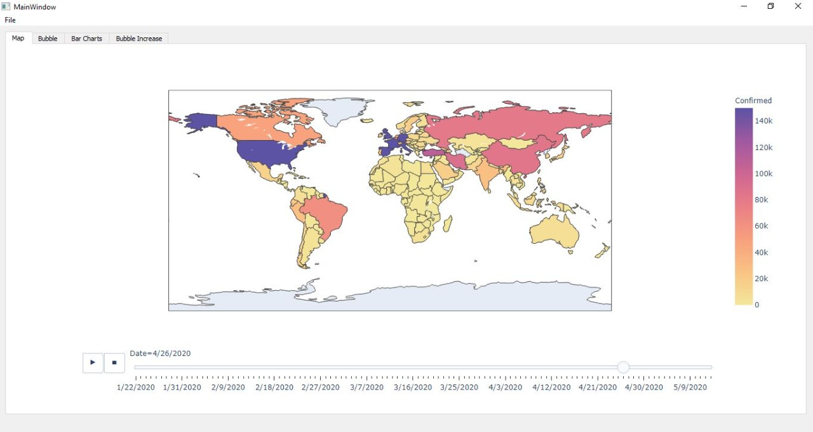
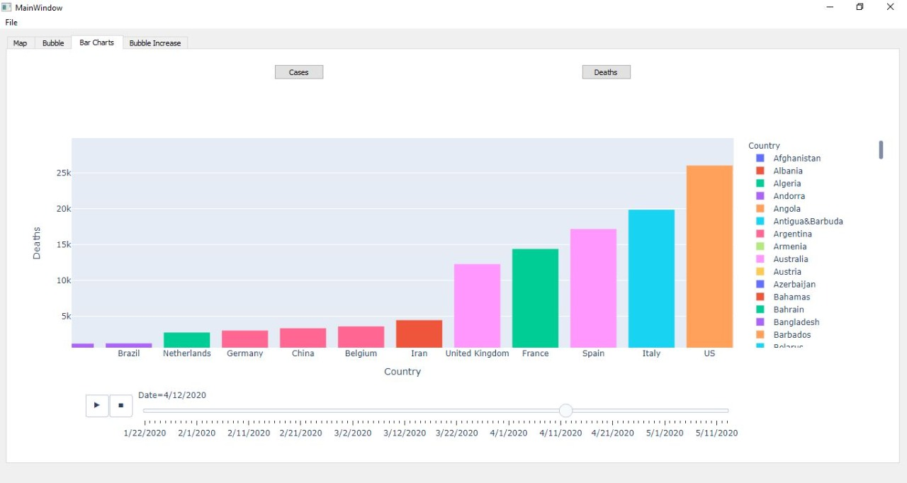
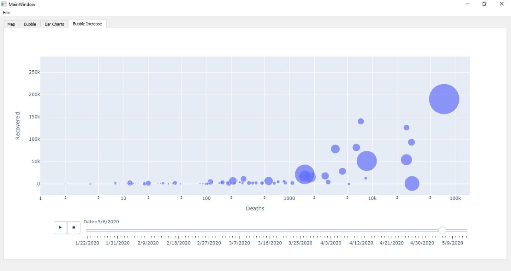

# COVID19-Data-Visualization

As in 2020, the world's major concern was the Covid-19 pandemic, Our Gui is a simple app that is implemented not only to collect the data but rather to visualize it in a way that would help decision makers to grasp the underlying information. Such as: (#cases, # deaths and # of recovered cases through time and in the different countries)
Our App allows the users to visualize the data in many and different ways as they see fit.

---

A. Animated bubble graph: x-axis is the number of deaths, y-axis is the number of recovered cases, the size of each 
country bubble is the # of its cases.

B. Animated maps graph: Using some colormap, each country in each frame is assigned a color that indicates the # cases or # number of death cases in this country. The user can click on any country on the map to plot its number of cases/deaths through time.

C. Animated Sorted chart (i.e. bar rank): each country is represented as bar on the chart. The length of the bar is the #cases or #deaths or both. The bars are always sorted (according to #cases or #deaths. Option in your UI) while running through time.

D. Animated bubble graph tailored to an idea of your own. i.e. you can choose the different axis (x, y, bubble size, bubble color) to elaborate or emphasize some specific observation/idea/conclusion based on this data. All animated figures can run through time (i.e days from a reference starting day, let’s assume it is 01/01/2020) through a stop/resume button. All figures can be exported to a video file through an Export button. Some resources to check (gapminder project, Hans Rosling Ted’s talk).

